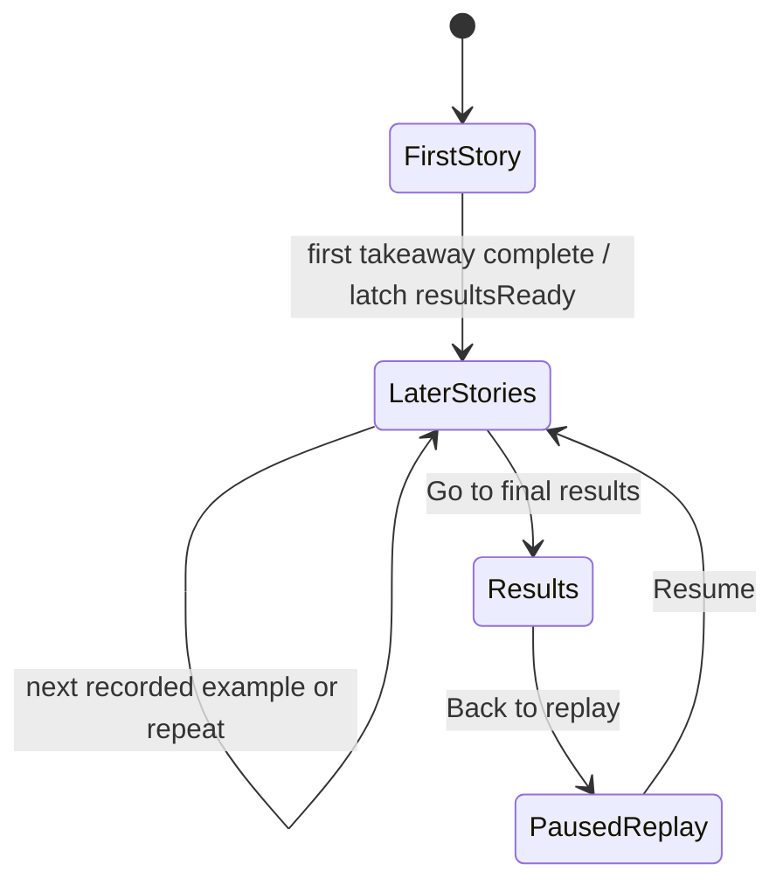

# P-DEMO — replay the discovery, then inspect the evidence

> **Latest implementation requirements — override older plans below:** `/demo` opens with a fuller
> explanation and a Launch button. The clock and activity wait for Launch. A **Results** link is
> visible immediately at bottom right, before Launch and throughout the run, and opens
> `/demo/results`. That destination is a route scaffold; the explorer is still to be designed.
> Generated text runs at 90% of its original speed, thinking pauses are 25% longer, and the square
> remains visible during the pause after generated output. The recorded finding stays open for
> **4.5 seconds**. The profile initials are **AP**. Follow the current code and demo README for
> implemented behavior. For results work, follow [P-RESULTS.md](./P-RESULTS.md): show real design
> references online and let the user choose before building the presentation.

> **Selected visual direction:** The user chose Linear-style agent activity. `/demo` now presents
> a chronological feed of expandable agent sessions, one per started case. Each session contains
> the existing five stages and evidence. Cases arrive below automatically; previous/next navigation
> is removed. Manual review preserves the selected session and step while the run advances.
> Follow live opens the latest session and follows subsequent steps/cases. The five `/demo-lab`
> alternatives were rejected and are no longer linked from the monitor.
> The user specifically asked to match Linear's actual symbols and structure, not restyle the old
> accordion. Use plain narration above compact expandable action rows, filled file/terminal-style
> symbols, inline context and disclosure triangles, and a dot-matrix working indicator. Remove
> numbered stage headers, rails, badges and repeated card frames. Actions appear as they start.
> **Pacing:** generated output determines action duration. Keep fast character typing and advance
> after a short reading beat; do not finish the text and then wait several seconds on the thinking
> square. Stop the working indicator when output completes. Explanations and findings stay instant.

> **Implementation steering (2026-09-10):** Build only the story first. The user requested a list
> of persistent step headings with one expanding text box at a time, a small spinner and a red
> dot at the active step. The screen is titled **Live monitor**. Explanations appear immediately;
> generated code types quickly by character with an inline caret; verdicts arrive as complete updates.
> The final finding is static. The five underlying stages remain repository signal, attack program,
> agent comparison, confirmation, and finding; the visible action labels use verbs, as in Linear.
> The separate admission-check section is removed.
> A small case counter accompanies the growing activity feed. The reader's selected case and
> section stay open as the monitor advances; **Follow live** returns to the current case and step.
> Case totals, change surfaces, and evidence come from case data, not a documentation-only template.
> No intro headline,
> timer, help sentence, playback controls, or simulation labels appear on screen. The presenter
> explains the simulation separately. This supersedes the original single panel and replay UI below.
> Results and their navigation action
> remain the next phase. See `src/app/demo/README.md` for the implemented entry point and controls.

**Status: story implemented; results planned.** Prepared 2026-09-10 for
`AndreiPiterbarg/OpenAiAdversary`. The replay and results presentation were planned by separate
agents. The accordion story is available at `/demo` with illustrative data. The results explorer
follows after the replay's visual and interaction review. The target is the desktop website view.

**The experience:** a completed run plays back as a deliberate, readable terminal sequence inside
the existing dashboard. One concrete failure becomes understandable. At the end of the first
story, **Go to final results** appears at bottom right. Subsequent stories continue to play; the
button remains available. Clicking it opens a separate, stable page for investigating the evidence.

**The sentence to make land:** “The adversary writes the perturbation; you can inspect what changed
and what the agent did.” A measured paired case can additionally support: “This task passed under
control and failed under the recorded perturbation.” Neither sentence implies general coverage.

## 1. Scope and precedence

- Work in `/Users/andre/Desktop/OpenAiAdversary`, whose remote is
  `https://github.com/AndreiPiterbarg/OpenAiAdversary.git`. All edits and any commits stay inside
  **`frontend/`**, using explicit paths. Do not stage the repository wholesale.
- The source brief at `/Users/andre/Desktop/vision_adversary/prototype/prompts/P-DEMO.md` and this
  repository's root `prompts/P-DEMO.md` are context. They contain paths, measurements and instructions
  inherited from another checkout. This brief incorporates the user's newer two-page flow and
  frontend-only boundary. Do not edit either source prompt during this work.
- Use the actual frontend as the visual authority. Preserve `globals.css`, `tailwind.config.ts`
  and existing dashboard components during the replay build, except a narrowly scoped entry link
  from the projects route if useful. New replay styles belong in a CSS module.
- No backend integration, model calls, jobs, training, publishing or broad product redesign in this
  phase. The run artifact will be supplied later; use explicitly marked proxy data now.
- For implementation detail and alternatives, read the independent
  [demo replay plan](../docs/research/demo-replay-plan.md). The
  [results presentation plan](../docs/research/results-presentation-plan.md) is the next-phase brief.
  Where those drafts differ, this file owns the shared route and handoff contract.

Evidence labels in this brief: **[REPO]** source or rendered UI checked in this session;
**[V]** fetched primary documentation; **[DESIGN]** our proposed behavior;
**[PROXY]** invented demonstration content. Proposed durations and dimensions are design choices,
not research findings or measured run results.

## 2. What the inspection changed

The inspected base is commit `3616dfd17d7c47af51fe6c2904b9d6962c516da5`. [REPO]

| Existing surface | What is actually there | Consequence for this build |
| --- | --- | --- |
| `src/components/dashboard/dashboard-shell.tsx` | Shared dark shell, 1200px outer width, 156px sidebar, 936px content cap | Reuse the component on both new pages. The shell does not come automatically from the dashboard layout. |
| `src/app/dashboard/layout.tsx` | Pass-through layout | `/demo` can reuse the exact shell without moving existing routes. |
| `processing-loader.tsx` | Timer-driven phase labels and an animated ghost; no terminal events | Build a dedicated replay player. Its clock describes playback, not inference progress. |
| `loading-lab-page.tsx` | Remounts the loader to loop | Reuse the idea of repeating a presentation, not its entire-component reset pattern. |
| `summary-page.tsx` | Image-gallery results, first 20 entries, binary pass/fail; substitutes expected text for passed model output | Do not reuse this data model or response synthesis for the evidence page. |
| `dashboard-list.tsx` and wizard buttons | Existing card, status-chip and primary-action recipes | Copy their visual rules; retain familiar hierarchy and interaction weight. |
| `src/app/layout.tsx` | Defines Geist variables without applying their font families | Keep the currently rendered system sans for UI text. Explicitly scope Geist Mono to new terminal/code content. |

The rendered Projects heading uses the system sans stack at 24px and weight 300. The old brief's
claim that the UI already uses Geist is inaccurate. Loading a font variable alone does not apply
it; Next's font documentation shows the additional CSS application. [REPO]
([font styles](https://nextjs.org/docs/app/api-reference/components/font#applying-styles)). [V]

The old brief's “100 seconds” script actually ends at 120 seconds, leaving no time to inspect the
result. Its long pin/mining opening and refusal-ledger ending weaken the user's requested handoff.
Keep the program-generation beat and honest limitations; make the visible failure the climax.
The new first story lasts **72 seconds**, leaving time in a two-minute presentation to use the
results page. [REPO, DESIGN]

## 3. The visual contract

These literals come from the current components; generic shadcn defaults do not match them. [REPO]

| Element | Match |
| --- | --- |
| Page / panel / inset | `#111111` / `#1a1a1a` / `#222222`; secondary surface `#171717` |
| Border / hover border | `#222222` / `#333333` |
| Main text / secondary text | `#eeeeee` / `#aaaaaa` |
| Quiet metadata | `#8f8f8f` or `#777777`; never use these for the main evidence |
| Pass or admitted | Green text `#2aff7c`, chip fill `rgba(52,199,89,0.4)` |
| Failed, rejected or attention needed | Yellow text `#ffd600`, fill `rgba(255,146,48,0.4)`; always include a distinct word/icon |
| Provenance and active model | Cyan text `#00ffff`, fill `rgba(0,136,255,0.4)` |
| Card | `rounded-[8px] border border-[#222222] bg-[#1a1a1a] p-6` |
| Small code/status insets | `rounded-[2px]`; existing full chips can retain 8px |
| Heading / body | `text-2xl font-light`; `text-sm`; section labels `font-semibold` |
| Primary action | `bg-[#fafafa] text-[#171717] rounded-[8px]`, following wizard CTA |
| Motion | Existing standard/emphasized easing variables; 160/220/280ms utilities |

**Hacker character comes from the reveal, the source code, and the sequence of meaningful events.**
Do not add a Matrix background, neon grid, scan lines, glow, random diagnostic noise, extra colors,
fake system failures or oversized bold numbers. Keep static chrome stable so the changing evidence
has something to move against. Preserve the existing ghost mark and shell in this phase; branding
cleanup is a separate decision, not a reason to redesign the demo. [DESIGN]

The headline and decisive evidence use at least 14px text at desktop size. Long names wrap or get a
readable detail affordance; do not shrink type to make a fixture fit. Preserve enough bottom space
for the fixed action to avoid covering evidence. On narrow screens stack the panels and place the
action in a full-width bottom action area with safe-area padding. [DESIGN]

## 4. DEMO FIRST: one complete story

The top of the page stays stable: project breadcrumb, `Run replay`, run ID, `EXAMPLE DATA`, playback
controls. The run status and the playback status are separate: a completed recording can currently
be playing or paused. Do not display `LIVE`, a model-call spinner, or a remaining compute estimate.
[DESIGN]

Inside the shell, use a dominant evidence panel and a compact event lane. Model roles occupy a
compact rail; when the paired comparison needs width, the rail becomes a single row. The evidence
panel changes content within a reserved area instead of stacking a new full-page dashboard at
every beat. Use at most two primary reading targets at once. [DESIGN]

```text
Projects > Evaluation demo > Run replay                 EXAMPLE DATA
run proxy-001 · recorded-run preview       Pause  Previous  Next  Restart

MINE —— GENERATE —— CHECK —— COMPARE —— CONFIRM —— TAKEAWAY

┌─────────────────────────────────────────────────────────────────┐
│ Same task. One changed channel.                                  │
│ Task / repository / permitted change                             │
│                                                                 │
│ CONTROL                         PERTURBED                        │
│ ✓ PASS                          ! FAIL                          │
│ Expected behavior preserved     Named failing assertion          │
│                                                                 │
│ The changed evidence and the exact observed failure              │
└─────────────────────────────────────────────────────────────────┘
Adversary            Scoring target       Filter         Target
Qwen3-8B             Devstral…            Not supplied   Astra…
> Check passed: permitted channel       > Paired verifier: mismatch

                           [ Go to final results → ]  ← after story 1
```

The wireframe illustrates hierarchy rather than an additional container outside `DashboardShell`.
Seat names are configured project context; any invented text attributed to a seat is explicitly
marked `Illustrative response`. A role with no supplied evidence is `Not measured`, not successful.
[DESIGN, PROXY]

Use the independent demo plan's exact 72-second timing table. Its required narrative order is:

1. **Bind the story.** Show what the task should do and identify the permitted channel. Keep pins
   and digests in persistent metadata rather than spending a full beat deciphering them.
2. **Mine and generate.** Connect a repository-history seed to the adversary's hypothesis. Reveal
   an excerpt of the generated program, including the declared channel and the consequential
   clause. The program is the product differentiator; it must remain legible after typing ends.
3. **Check.** Show why the featured candidate is valid and why another candidate was rejected.
   Gate rejection is different from a target-agent failure. Gates implemented as code get no
   invented model seat.
4. **Compare.** Keep the task identity fixed while control passes and perturbation fails. Explain
   the changed input/environment, the first relevant observed divergence, and the verifier result.
   The viewer should be able to say what broke without reading a raw trace.
5. **Confirm or qualify.** Show recorded replication/transfer only when supported by the artifact.
   Otherwise say `Not measured` and retain the useful paired observation. Show the recorded model
   configuration for each arm; do not merge different targets or reasoning settings.
6. **Takeaway.** State the observed mechanism and practical consequence in one sentence. Show a
   compact evidence-limit note. End with the persistent results action.

For proxy data, use a fictional software repository and a realistic proposed fixture, such as a
stale task-specific guidance file leading to a deprecated API choice. The fixture must include a
passing control, the changed guidance, an illustrative agent edit, and a consistent failing test.
The change must stay outside the declared oracle/test read set. This is a *fixture specification*,
not a result already observed or a claim that such a case has passed real admission gates. [PROXY]

The opening story is chosen deliberately through `featuredCaseId`; it is not automatically the
largest percentage or the first JSON row. Choose a complete, easy-to-explain paired case before a
larger, ambiguous finding. If measured data has no complete paired case, tell the weaker supported
story rather than retaining the proxy's verdict. [DESIGN]

## 5. The loop and bottom-right action are a state contract

**Two independent facts:** the story has reached its takeaway, and the results snapshot can be
read. A running second replay must never make the snapshot incomplete or invalidate the link.



- Reveal **Go to final results** once, at the end of the first complete story. Make the whole
  button actionable as it enters; its label does not type character by character.
- `resultsReady` is monotonic for a given artifact revision. Pause, backward seek, repeated stories,
  automatic loops and ordinary Restart do not hide it. Only an explicit new-artifact reset clears
  it. Presenter Next still lets someone reach the final beat without waiting for real time.
- Later rounds can replay other *recorded* examples in a deterministic order. Their headings say
  `Next recorded example` or `Replaying this example`. Do not invent new candidate IDs, timestamps,
  findings, completed runs or cumulative counts each time around.
- The CTA uses `/demo/results?run=<runId>&case=<featuredCaseId>`, pinned to the opening story.
  Its destination must not silently change as later examples play. Build URLs with `URLSearchParams`.
- A click navigates immediately; it does not wait for typing or the current beat. Store the replay
  position and pause it when leaving. Browser Back and `Back to replay` restore it paused with the
  action still available. Results remain a fixed snapshot for that run.
- Direct results links work independently of watching the replay. Bad run/case IDs render a useful
  not-found state with a return action; they do not silently select an unrelated finding.
- Keep small playback state in the common route provider. Optional refresh persistence uses
  guarded session storage keyed by `runId` and artifact revision. Artifact loading must work
  without storage. Do not gate a direct results route on a local `resultsReady` flag.
- If a snapshot is unavailable or malformed, show the actual data error with retry/return actions.
  Do not display invented empty success, disable the action forever, or call a data error a model
  failure. Phase-one review must identify any results destination still awaiting implementation.

All of this section is proposed behavior. [DESIGN]

## 6. Motion that supports the story

- **Prose/events:** the existing word-reveal direction, approximately 22ms per word, with row
  staggering where useful. Keep long technical text stable once it has resolved.
- **Program excerpt:** approximately 26ms per character; one block cursor, and only this beat
  types source. Store a display excerpt and a reference to the full program. Never speed through
  hundreds of lines because the real artifact is longer.
- **Scramble:** approximately 340ms on a few short monospace identifiers. Leave punctuation and
  whitespace intact. Verdicts, assertions and the final conclusion stay readable; no scrambling.
- **Structure, controls and results:** instantly readable labels with existing entry transitions.
  On the later results page, selection and filtering never retrigger terminal typing.
- Reserve layout from the final text, without duplicate accessible readings. Resolve content by
  the first 60% of a beat, leaving the rest for comprehension. Adapt the excerpt, not the evidence.
- One timestamp-based `requestAnimationFrame` clock owns playback. Do not rerender the whole shell
  on every frame. Keep reveal work local and clean up callbacks/listeners on navigation.
- When the tab hides, freeze playback; resume on return only if it was previously playing. This
  avoids skipping the story because background callbacks are throttled.
- Provide visible, focusable Pause/Resume, Previous, Next and Restart. Keyboard shortcuts may
  supplement them but must ignore inputs, editable content, modifiers and native button activation.
- Previous/Next selects a fully resolved stage frame and pauses it. Resume continues from that
  stage's reading-hold position, without hiding or retyping the frame. This keeps manual navigation
  useful instead of pausing a blank animation at its initial timestamp.
- Reduced motion displays resolved text and disables scramble, typing, cursor blink, stagger and
  movement. Start paused with Play replay and Next stage available; autoplay remains available by
  choice. Screen readers receive concise stage announcements, not every glyph or every event in
  an updating log.

Timings are design starting points, not measured performance requirements. [DESIGN] Timestamp-based
animation and background throttling are documented by MDN; autoplay also needs an accessible pause
mechanism. [V] ([animation clock](https://developer.mozilla.org/en-US/docs/Web/API/Window/requestAnimationFrame),
[page visibility](https://developer.mozilla.org/en-US/docs/Web/API/Page_Visibility_API),
[Pause, Stop, Hide](https://www.w3.org/WAI/WCAG22/Understanding/pause-stop-hide.html)).

## 7. One artifact, two presentations

Create a typed, validated frontend view model and one replaceable fixture, such as
`src/lib/demo/run-data.ts` exporting `RUN`. This is a **proposed frontend contract**, not an existing
backend endpoint or exporter. Both screens select from this artifact; playback never mutates it.

Use these shared names when refining the implementation types. This outline describes field groups;
it is not an assertion that an upstream export already implements them. [DESIGN]

```text
RUN.identity  { id, schemaVersion, revision, source, recordedAt, recordedDurationMs }
RUN.models    [ stable model ID, display name, recorded configuration or missing fields ]
RUN.roles     [ role, model ID or null, description ]
RUN.cases     [ shared CaseRecord instances with evidence references ]
RUN.modes     [ discovered-group identity, grouping basis, evidence status ]
RUN.proposals [ candidate identity, gate decisions, case references if any ]
RUN.claims    [ supported statement or withheld claim, reason, evidence references ]
RUN.story     { featuredCaseId, replayCaseIds, beats }
```

`identity.source` is `proxy | recorded | mixed`; evidence-block source is
`proxy | recorded | missing`. UI labels are **EXAMPLE DATA**, **RECORDED RUN**, and **MIXED DATA**.
Recorded provenance describes the origin of evidence, not whether a causal or statistical claim
has been established. Use `passed | failed | unresolved` for outcome, a separate
`completed | truncated | error | unreached | unknown` execution-health field, and a separate
imported evidence/attribution status with references. URL `run` maps to `RUN.identity.id`; URL
`case` maps to a case ID. The playback state's `runId` is that identity, not a second ID system.

`RUN.story` contains presentation timing and wording. It selects immutable evidence rather than
copying or manufacturing result values. Review display excerpts when the real artifact arrives,
while keeping component layout and player logic unchanged.

| Shared record | Minimum information to reserve now |
| --- | --- |
| Run | Stable ID, schema version, artifact revision, source kind, recorded date or null, title, model configurations, snapshot completeness |
| Case | Stable ID, task/repository/base revision, discovered-group ID or null, dataset/split, permitted channel, applied change, control and treatment references |
| Evidence | Actual/illustrative response, patch/diff, verifier identity and verdict, test excerpt, optional trace and divergence marker, source references and missingness |
| Result | Observed outcome, validity/attribution status and reason; unresolved is distinct from a verified pass or failure |
| Story | Featured case ID, ordered beat definitions, evidence references, curated display excerpts, deterministic later-case order |
| Claims | Allowed summary statements, confirmation/transfer evidence or absence, limitations with reasons |

The same stable IDs link the replay's code, verdict and result selection. The full artifact contains
all records; the replay's curated subset does not become the report's dataset. Outcomes, candidate
gate decisions and confirmed mechanisms are separate entities. A passing control paired with a
failing treatment is useful evidence; confirmation across a population requires its own receipts.

Normalize source fields at one boundary. For context, the other local checkout stores episodes,
trajectories and unreached records separately. An episode may be unrealised or truncated; a
trajectory may have an infrastructure error. Those facts prevent treating every stored row as a
clean evaluated failure. Those files were inspected read-only; they are not imported at runtime
and their export shape is not promised here. [REPO]

**Required data rules:** [DESIGN]

- Everything is `proxy` initially, including displayed pins and mining figures. Do not copy old
  figures and declare them newly verified. Show `EXAMPLE DATA` on both screens.
- Source provenance belongs to evidence as well as the run. A mixed artifact stays visibly mixed.
  Flipping one top-level label must never certify invented outputs, pins or dates as measured.
- All displayed counts derive from records in explicitly named populations. Keep proposals,
  attempted cases, evaluated arms, paired cases and confirmed modes distinct. Show missingness
  alongside any denominator; an absent result is not zero and is never a pass.
- Validate unique IDs, references, status/receipt consistency, finite numbers, denominators and
  monotonic cue timing. Missing optional evidence gets `Not supplied` or `Not measured`; missing
  required identity or broken references produce a data error.
- The real-data handoff replaces the normalized artifact and its evidence, not JSX or CSS.
  Verify that changing case counts, role names, title lengths and absent confirmation needs no
  component edits. If the selected hero no longer exists, report that broken reference.
- Logs, diffs and generated source are inert text. The browser does not execute them, render raw
  HTML from them, or fetch arbitrary paths supplied by a report.

## 8. Build order and exact frontend seams

**First deliverable: the replay.** [DESIGN]

1. Add `src/lib/demo/` for the run type, fixture, validation and pure story selectors. Add a
   single hero case and the other records needed to show truthful proxy counts. Do this before
   animation so the story and its evidence cannot diverge.
2. Add `src/app/demo/layout.tsx` using `DashboardShell activeSection="projects"`. A small client
   provider can share playback position and readiness across the two nested routes. Do not mount
   another shell in either page. Keep the global dashboard layout unchanged.
3. Add `src/app/demo/page.tsx` and focused components under `src/components/demo/`: replay player,
   stage navigation, evidence display, role strip, event lane and final-results action. Keep new
   styles in `demo.module.css`; use existing utility classes wherever possible.
4. Build the fully resolved frames first and review them at presentation size. Then add the one
   playback clock, graded reveals, pause/seek/restart and repeated-story behavior. This order
   makes legibility review possible before motion hides layout problems.
5. Wire the handoff and restore behavior. The separate results page is phase two; if a minimal
   read-only landing is needed to review navigation earlier, label it as an interim result preview.
   Do not route to the existing vision summary or call a placeholder the finished explorer.
6. Make `/demo` directly accessible. An optional small `Watch demo` link can use the Projects
   route's existing `DashboardListPage.topRight` slot without changing that component or wizard.

Use ordinary Next links/client navigation. Prefetch the results route before the final beat so
the CTA does not introduce another artificial wait. Static pages using a client `useSearchParams`
reader need a `Suspense` boundary in production; alternatively resolve the page's searchParams
server-side. Test the chosen approach in a production build. [V]
([navigation](https://nextjs.org/docs/app/getting-started/linking-and-navigating),
[query state](https://nextjs.org/docs/app/api-reference/functions/use-search-params)).

**Second deliverable, after the replay review: the results explorer.** Preserve the same shell,
source labels and case IDs. Begin with the featured case selected, a full searchable case index,
compact paired verdicts, readable diffs/observed outputs, verifier evidence and an expandable trace.
Keep unresolved records visible. The independent results plan defines the full interaction and
the width tradeoff; do not squeeze two full code editors alongside a list into the existing shell.

This follows useful evidence-navigation patterns: Promptfoo links findings to raw input/output
cases, and Langfuse supports aggregate-to-comparison evaluation workflows. Our recommended layout
is a project-specific design inference, not a claim that either product validates it. [V, DESIGN]
([Promptfoo report](https://www.promptfoo.dev/docs/red-team/quickstart/#view-the-results),
[Langfuse comparison](https://langfuse.com/docs/evaluation/experiments/experiments-via-ui#compare-runs)).

## 9. Verification and review gates

The clean cloned baseline passed `npm ci --no-audit --no-fund` and `npm run build` on Node 22.23.2.
Its locked Next version is 16.1.6. Browser inspection covered Projects and the existing summary.
This is baseline verification, not proof that the proposed replay exists. [REPO]

Two tooling failures are pre-existing: `npm run lint` invokes removed `next lint`; `npx eslint src`
fails with a circular-config error from the FlatCompat setup. During implementation, fix the
frontend lint script/config using the installed Next flat exports, without upgrading dependencies
or disguising warnings as a successful lint run. Next documents the CLI removal. [REPO, V]
([ESLint guidance](https://nextjs.org/docs/app/api-reference/config/eslint)).

For the replay review, demonstrate these behaviors rather than only checking screenshots:

- First story completes in its specified duration. Its fully resolved program, changed channel,
  control outcome and treatment evidence can each be read while the beat is on screen.
- The results button is absent before the first takeaway, then remains present during later
  rounds, pause, backward seek and restart. Clicking it never waits for an animation boundary.
- Replays are deterministic. Looping does not increase the immutable report's counts or create
  new measured timestamps. Refresh starts consistently; restored state is scoped to the artifact.
- The shared shell, typography, colors, borders and radii match Projects in adjacent browser views.
  Review at 1920×1080, a 1280×720 laptop view, and 390px width; no covered action or document-level
  horizontal overflow. Code may scroll within its own container.
- Tab-hidden handling, keyboard controls and reduced motion work. Navigating away removes the
  replay's active animation work. Enter/Space on a focused button does not also trigger a global
  playback shortcut.
- Replace the fixture with a differently shaped one: longer text, fewer/more cases, no transfer,
  missing confirmation, unresolved attempts and no verified failures. Layout survives and copy
  reports the actual state. A malformed required reference yields an explicit data error.
- Run focused tests of the clock/state transitions and data invariants, type checking, corrected
  lint and the production build. Tests should cover those consequential behaviors, not mirror
  every visual element.
- Rehearse from a locally running production build with external internet disconnected. Bundle
  data/assets locally, and confirm the build has supplied its fonts. A local Next server is still
  required; “offline” is not a promise that arbitrary routes open as standalone `file://` pages.

After phase two, also verify the exact CTA-to-featured-case handoff, direct links, preserved filters
and Back behavior, complete access to every case, and unchanged results while other replay rounds
would have been running. Those remain outstanding until the results page is implemented.

**Review order:** resolved demo frames → first story playback → persistent action and repeated
stories → proxy replacement → results presentation. Build the demo first and use its actual
evidence to evaluate the second page.
